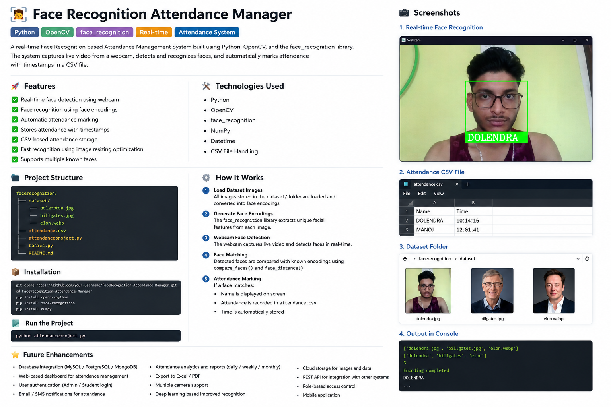
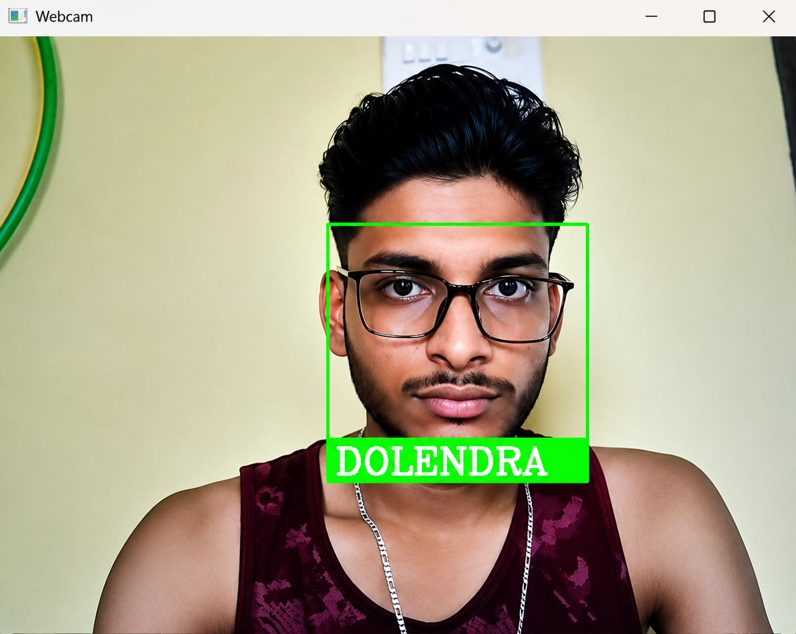
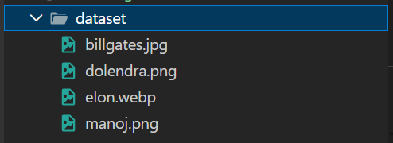
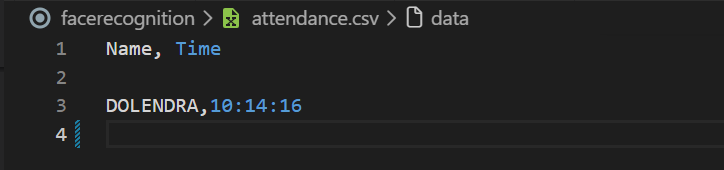

# 🎯 Face Recognition Attendance Manager

A real-time Face Recognition based Attendance Management System built using **Python**, **OpenCV**, and the **face_recognition** library.

The system captures live video from a webcam, detects and recognizes faces, and automatically marks attendance with timestamps in a CSV file.

---

# 🌟 Project Preview



> 📌 Add the infographic image inside:
>
> ```bash
> screenshots/project-overview.png
> ```

---

# 🚀 Features

- 📷 Real-time face detection using webcam
- 🧠 Face recognition using face encodings
- ✅ Automatic attendance marking
- ⏱️ Stores attendance with timestamps
- 📁 CSV-based attendance storage
- ⚡ Fast recognition using image resizing optimization
- 🖼️ Supports multiple known faces
- 🔍 Face matching using Euclidean distance
- 💻 Live webcam monitoring
- 🧾 Easy dataset management

---

# 🛠️ Technologies Used

| Technology | Purpose |
|---|---|
| Python | Core Programming Language |
| OpenCV | Image Processing & Webcam Handling |
| face_recognition | Face Detection & Recognition |
| NumPy | Numerical Operations |
| Datetime | Attendance Timestamp |
| CSV | Attendance Data Storage |

---

# 📂 Project Structure

```bash
facerecognition/
│
├── dataset/
│   ├── billgates.jpg
│   ├── dolendra.png
│   └── elon.webp
│
├── screenshots/
│   ├── project-overview.png
│   ├── realtime-face-recognition.png
│   ├── dataset-folder.png
│   └── attendance-csv.png
│
├── attendance.csv
├── attendanceproject.py
├── basics.py
├── requirements.txt
└── README.md
```

---

# ⚙️ How It Works

## 1️⃣ Load Dataset Images

All images inside the `dataset/` folder are loaded and converted into facial encodings.

---

## 2️⃣ Generate Face Encodings

The `face_recognition` library extracts unique facial features from each image.

---

## 3️⃣ Start Webcam

The webcam captures live video frames in real-time.

---

## 4️⃣ Detect & Recognize Faces

Detected faces are compared with known face encodings using:

```python
face_recognition.compare_faces()
face_recognition.face_distance()
```

---

## 5️⃣ Mark Attendance

If a face matches:

- Name is displayed on screen
- Attendance is recorded in `attendance.csv`
- Time is automatically stored

---

# 📸 Screenshots

## 🖥️ Real-Time Face Recognition



---

## 📁 Dataset Folder



---

## 📄 Attendance CSV Output



---

# 📊 Sample Attendance Output

```csv
Name,Time

DOLENDRA,10:14:16
MANOJ,12:01:41
```

---

# 🧠 Face Recognition Logic

The project uses:

- Face Detection
- Face Encoding
- Face Matching
- Euclidean Distance Comparison

The face with the **minimum distance** is considered the best match.

---

# 💻 Installation Guide

## 🔹 Step 1: Clone Repository

```bash
git clone https://github.com/your-username/FaceRecognition-Attendance-Manager.git
```

---

## 🔹 Step 2: Navigate to Project Folder

```bash
cd FaceRecognition-Attendance-Manager
```

---

## 🔹 Step 3: Create Virtual Environment (Optional but Recommended)

### Windows

```bash
python -m venv venv
venv\Scripts\activate
```

### Linux / Mac

```bash
python3 -m venv venv
source venv/bin/activate
```

---

## 🔹 Step 4: Install Dependencies

```bash
pip install -r requirements.txt
```

If `requirements.txt` is not available:

```bash
pip install opencv-python
pip install face-recognition
pip install numpy
```

---

# ▶️ Run the Project

```bash
python attendanceproject.py
```

After running:

- Webcam opens automatically
- Face gets detected
- Attendance is marked in CSV file

---

# 📦 requirements.txt

Create a `requirements.txt` file and add:

```txt
opencv-python
face-recognition
numpy
```

---

# ➕ Add New Faces

## Step 1

Add image inside the `dataset/` folder

Example:

```bash
dataset/john.jpg
```

---

## Step 2

Run the project again.

The system automatically recognizes:

```txt
JOHN
```

---

# 📈 Performance Optimization

To improve real-time performance:

- Frames are resized to 25% of original size
- Face recognition is performed on smaller frames
- Bounding box coordinates are scaled back for display

```python
imgsmall = cv2.resize(img,(0,0),None,0.25,0.25)
```

This significantly improves FPS and recognition speed.

---

# 🔮 Future Enhancements

- 🗄️ Database Integration (MySQL / MongoDB / PostgreSQL)
- 🌐 Web-based Attendance Dashboard
- 🔐 Admin & Student Authentication System
- ☁️ Cloud Deployment
- 📊 Attendance Analytics & Reports
- 📧 Email / SMS Notifications
- 📱 Mobile Application
- 🎯 Deep Learning Based Recognition
- 🧾 Export Attendance to Excel / PDF
- 🎥 Multiple Camera Support
- 🧠 AI-based Emotion Detection
- 🛰️ REST API Integration
- 👥 Role-Based Access Control
- 🔔 Real-Time Notifications

---

# 📚 Learning Outcomes

Through this project, I learned:

- Computer Vision fundamentals
- Face Recognition concepts
- OpenCV image processing
- Real-time webcam handling
- Python file handling
- Working with facial encodings
- Optimizing real-time applications

---

# 🤝 Contributing

Contributions are welcome!

Feel free to:

- Fork the repository
- Create feature branches
- Submit pull requests

---

# ⭐ Support

If you like this project:

⭐ Star the repository  
🍴 Fork the project  
📢 Share with others

---

# 👨‍💻 Author

## Dolendra

- 🚀 Full Stack Developer
- 🤖 Machine Learning Enthusiast
- ⚡ DevOps Learner

---

# 📜 License

This project is licensed under the MIT License.
